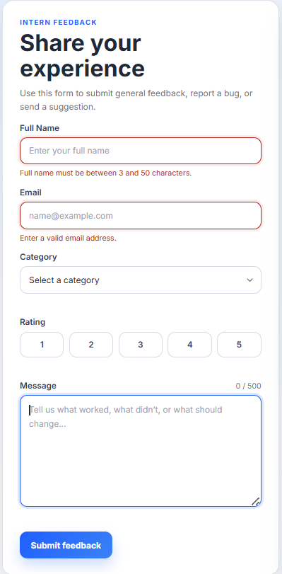
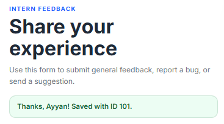
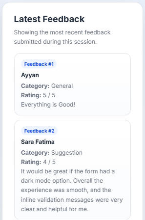

# Intern Feedback Form

A simple, accessible feedback form built with plain HTML, CSS, and JavaScript. Interns can submit feedback about their week — the form validates input on the client side, sends it to a mock REST API, and clearly shows loading, success, or error states.

# Intern Feedback Form

**Live Demo:** [intern-feedback-form](https://intern-feedback-form.vercel.app/)

A simple, accessible feedback form built with plain HTML, CSS, and JavaScript...
## Features

- Fully accessible form with linked labels for every field
- Client-side validation with inline error messages (no `alert()` popups)
- Sends data via `fetch()` as a POST request to a mock API
- Handles loading, success, and error states clearly
- Displays the returned record ID on successful submission
- Bonus: shows the 5 most recently submitted feedback entries, saved locally so they persist even after a page refresh
- Live character counter on the message field
- Fully responsive design (tested at 375px and 1280px)

## How to Run

1. Clone or download this repository
2. Open `index.html` directly in any modern browser
   *(no build step, no server, no dependencies required)*

## Which API I Used and Why

I used **[JSONPlaceholder](https://jsonplaceholder.typicode.com/posts)** as the mock REST API. I chose it because it requires zero setup — no account, no API key — and it correctly simulates a real API by returning an HTTP 201 status along with a new record `id` on every POST request, which was exactly what the task needed to demonstrate a working frontend-to-backend connection.

## What I Learned / What Was Hard

This task gave me hands-on experience connecting a frontend form to a real REST API for the first time, and it made concepts like fetch(), async/await, and handling loading, success, and error states click in a way that just reading about them never did. The trickiest part was learning that fetch() does not automatically throw an error on failed responses like 404 or 500 — I had to manually check response.ok to catch those cases correctly. I also ran into an interesting issue where JSONPlaceholder, being a fake API, kept returning the same id (101) for every submission since it doesn't actually save data, so I had to build my own local ID system using localStorage to keep a real, working "Latest Feedback" list that persists even after a page refresh. Overall, this task pushed me to think more carefully about edge cases — like what happens when the network fails, or when the API doesn't behave the way you'd expect — rather than just handling the happy path.

## Screenshots

**Validation errors:**

**Success message:**

**Latest Feedbacks:**

## Tech Used

- HTML5
- CSS3
- Vanilla JavaScript (fetch API, async/await)
- JSONPlaceholder (mock REST API)
